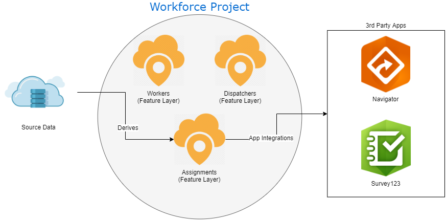
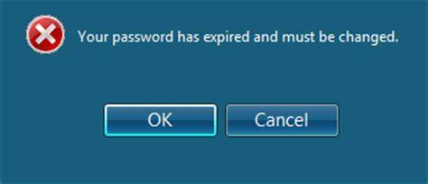

<!-- class: tangerine -->
<style>
    pre {
        font-size: 20px;
    }
</style>
<style scoped>
    img {
        width: 100px;
        float: right;
    }
</style>

# Automating Workforce with Python Notebooks and Jenkins Automation Server

Presented By: Gregg Roemhildt
https://github.com/roemhildtg/gis-lis-2019

<br />

[](https://wsbeng.com)


---
<!-- class: invert -->

# About Me

 - Web Developer @ [WSB](https://wsbeng.com)
 - Python, Javascript (NodeJS, ES6)
 - Web GIS (Workforce, Survey123, Enterprise, PostGIS)

---

# Our scenario
- 300+ projects
- 100 + inspectors
- Daily inspections

---

 # Why Automate Workforce?

 - Save time
 - Reduce errors
 - Provide consistent assignments data

---

# What is Workforce?

Feature layers, Applications, and Integrations



---


# Traditional Automation Approach

 - Windows Task Scheduler
 - Python/ArcGIS Desktop
 - Usernames/Passwords in your script or environmental variables
 
---



---

# Issues

 - Difficult to migrate and update
 - Credential management is cumbersome
 - No batteries included


---

# Web Centric Automation
 - [Jupyter Notebooks](https://jupyter.org/)
 - [ArcGIS Python API](https://developers.arcgis.com/python/)
 - [Jenkins Automation Server](https://jenkins.io/)

---
<style scoped>
img {
    position: absolute;
    top: 40%;
    right:15px;
    height: 200px;
}
</style>


# Jupyter Notebooks 

 - Exploratory python scripting
 - Easy to document and explain
 - Converts to executable python script
 - ArcGIS Python API

---

<style scoped>
img {
    position: absolute;
    top: 60%;
    right:15px;
    width: 400px;
}
</style>


# Jenkins

 - Free and open source task automation server
 - Detailed logging
 - Secure credentials
 - Powerful scheduling
 - Email notifications
 - Automatic cleanup
 - Extendable with plugins

---


## Development Overview


---

## Python Logic


---

## Python Schema
<style scoped>
    img {
        padding:50px;
        background: rgba(255,255,255,0.1);
    }
</style>


---

# Development Tips

 - Use a virtual environment for all installed modules
 - Save dependencies to a [`requirements.txt`](https://www.idkrtm.com/what-is-the-python-requirements-txt/) file
 - [Use `.env` files for all configuration parameters](https://preslav.me/2019/01/09/dotenv-files-python/)
 - Do not save credentials to your script files or repository

requirements.txt:
 ```
arcgis==1.6.2.post1
Shapely==1.6.4.post2
environs==6.0.0
 ```


---

# Jenkins Tips

 - Don't be intimidated
 - Use the question mark buttons
 - Read the docs
 - Check out the plugins
    - [Generic webhook plugin](https://wiki.jenkins-ci.org/display/JENKINS/Generic+Webhook+Trigger+Plugin)
    - [ShiningPanda Plugin](https://wiki.jenkins.io/display/JENKINS/ShiningPanda+Plugin) - Automatically sets up virtual environments for your tasks

---

## [Demo - Jupyter](http://localhost:8888/tree)
 - Jupyter and ArcGIS API comes preinstalled with Pro
 - Can also be easilly installed using pip

```bash
# create our custom environment
# packages we install will live here in development
virtualenv env
# *nix, git bash:
source env/Scripts/activate
# On windows instead run 
.\env\Scripts\activate.bat

# install any modules we need in our notebook
#pip install <module name> <module name...>
pip install arcgis Shapely jupyter environs

# run the notebook program
jupyter notebook
```

---

# Interacting with code

 - Run `Shift + Enter` to run a cell
 - Get the result by simply your cell with a variable 


---


----

# Demo - Jenkins

 1) Configure credentials (Git, ArcGIS, etc)
 2) Configure config files (Parameters for script)
 3) Configure tasks (builds)


---

### <!--fit--> :question:

---
<!-- class: default  -->

## Thank you!

Gregg Roemhildt - groemhildt@wsbeng.com


https://github.com/roemhildtg/gis-lis-2019/dist/


[](https://wsbeng.com)