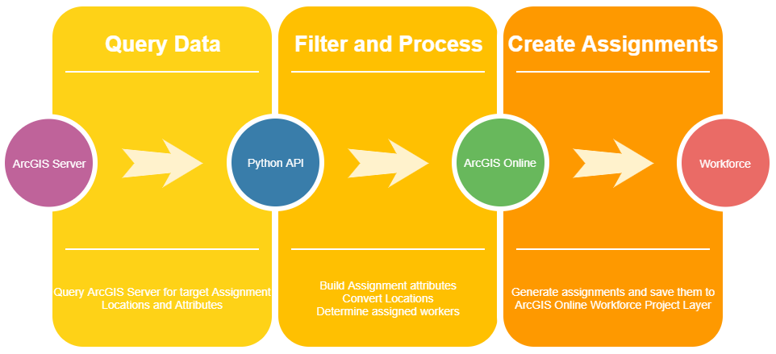

# Automating Workforce assignments with Python Notebooks and Jenkins Automation Server

Presented By: Gregg Roemhildt
https://github.com/roemhildtg/

<style scoped>a { color: #eee; }</style>

---

# About Me

 - Web Developer @ [WSB](https://wsbeng.com)
 - Python, Javascript (NodeJS, ES6)
 - Web GIS (Workforce, Survey123, Enterprise, PostGIS)

---

# What is Workforce?

Feature layers, Applications, and Integrations


---

 # Why Automate Workforce?

 * Save time
 * Reduce errors/provide consistency
 * Standardize assignments data
 * Our scenario: 
 * 300+ projects, Daily inspections, 100 + inspectors


---

# Components
 * Workforce for ArcGIS
 * [Jupyter Notebooks](https://jupyter.org/), Python, & [ArcGIS Python API](https://developers.arcgis.com/python/)
 * [Jenkins Automation Server](https://jenkins.io/)

---
<style scoped>
pre {
    font-size: 20px;
}
img {
    position: absolute;
    top: 40px;
    right: 100px;
    height: 100px;
}
</style>


# Jupyter Notebooks 

 * Exploratory python scripting
 * Easy to document and explain
 * Converts to executable python script
 * ArcGIS Python API
 * ```python
        # Example of a custom assignment
        workforce.Assignment(
            description = f'{contact_name}, {contact_phone}',
            location = f'Inspection at {project_name} - Project #{project_number}', 
            due_date = today + datetime.timedelta(hours=12),
            # .....
        )
        ```
---


 * Powerful task automation tool
 * Free and open source
 * Detailed logging
 * Secure credentials
 * Powerful scheduling
 * Email notifications
 * Automatic cleanup
 * Extendable with plugins

---

## Jenkins in GIS

 * Build your apps
 * Publish services
 * Service Status Checks (are my services up?)
 * Automate tasks

---

### When can tasks be run?

 * Manually
 * Run tasks on a trigger (webhook)
 * Run on a schedule
    * Midnight
    * Once every hour
    * Once every hour at exactly 30 minute mark

---

## Development Overview


---

## Python Logic



---

## Python Schema
<style scoped>
    img {
        padding:50px;
        background: rgba(255,255,255,0.1);
    }
</style>


---

# Development Tips

 * Use a virtual environment for all installed modules
 * Save dependencies to a `requirements.txt` file
 * [Use `.env` files for all configuration parameters](https://preslav.me/2019/01/09/dotenv-files-python/)
 * Do not save credentials to your script files or repository


---

# Jenkins Tips

 * Use the question mark buttons
 * Don't be intimidated
 * Read the docs
 * Check out the plugins
    * [Generic webhook plugin](https://wiki.jenkins-ci.org/display/JENKINS/Generic+Webhook+Trigger+Plugin)
    * [ShiningPanda Plugin](https://wiki.jenkins.io/display/JENKINS/ShiningPanda+Plugin) - Automatically sets up virtual environments for your tasks

---

## [Demo - Jupyter](http://localhost:8888/tree)
 - Jupyter and ArcGIS API comes preinstalled with Pro
 - Can also be easilly installed using pip

```bash
# create our custom environment
# packages we install will live here in development
virtualenv env
source env/Scripts/activate

# install any modules we need in our notebook
#pip install <module name> <module name...>
pip install environ Shapely

# run the notebook program
jupyter notebook
```

---

# Interacting with code

 - Run `Shift + Enter` to run a cell
 - Get the result by simply your cell with a variable 


---


----

# Demo - Jenkins

 1) Configure credentials (Git, ArcGIS, etc)
 2) Configure config files (Parameters for script)
 3) Configure tasks (builds)


---

### <!--fit--> :question:

---

## Jupyter Alternatives:
 - PyCharm
 - VSCode
 - ...

## Script Language alternatives

 - ArcGIS REST JS API (node)

---

